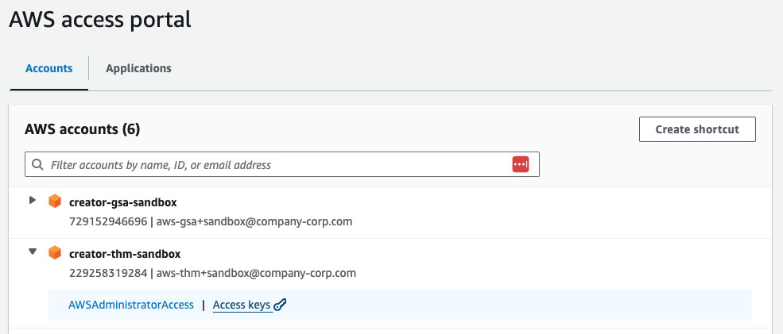
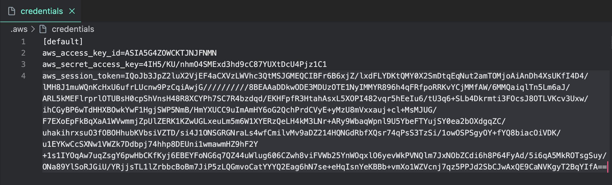

# Get Started

Learn how to use the Vastly command-line interface (CLI) to configure and manage your Vastly account
and infrastructure from the command line.

## Vastly CLI Overview

import { Tab, Tabs } from "nextra-theme-docs"
import { Steps } from "nextra/components"
import { Text, SimpleGrid } from "@vastly/ui"

With `@vastly/cli`, you can interact with the
backend of your application using your terminal. This enables you to [login](/vastly-cli/login) and
[logout](/vastly-cli/logout) of your Vastly account, store and manage [env](/vastly-cli/env) variables, and more!

## Installing Vastly CLI

Vastly CLI is included as a dependency of `create-wave-app` or as a stand-alone package:

<Tabs items={["npm", "yarn"]}>
  <Tab>
  ```bash copy filename="terminal"
  npx i -g @vastly/cli
  ```
  </Tab>
  <Tab>
  ```bash copy filename="terminal"
  yarn global add @vastly/cli
  ```
   </Tab>
</Tabs>

## Adding your AWS Credentials

<Steps>
### Login to the Vastly [AWS Portal](https://us-east-1.signin.aws/platform/login?workflowStateHandle=6f1c1654-1d17-4115-aa7d-4f87ee6b1fc5)

### Select the proper account and select `Access Keys`:
  

### Use `Option 2` and save the credentials to your `~/.aws` file
  
</Steps>

## Available Commands

<SimpleGrid columns={2} spacing={10} mt={10}>
  <Text>[- env](/vastly-cli/env)</Text>
  <Text>[- login](/vastly-cli/login)</Text>
  <Text>[- logout](/vastly-cli/logout)</Text>
  <Text>[- whoami](/vastly-cli/whoami)</Text>
</SimpleGrid>
